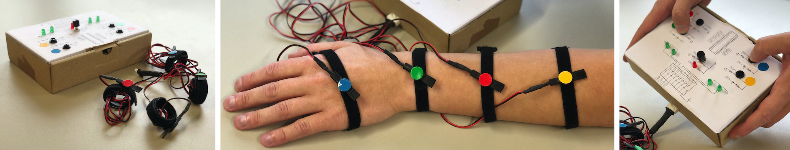

# TactJam
A collaborative playground for composing spatial tactons.


## How to contribute

Anyone with the passion for free software and hardware is welcome to contribute to this project by:

+ 👩‍💻 developing software
+ 🚀 designing hardware
+ 📝 writing tutorials or documentation in the [wiki](https://github.com/derikon/TactJam/wiki)
+ 👾 filing any [issues](https://github.com/derikon/TactJam/issues)  or suggesting new features
+ 🧑‍🏭 sending [pull requests](https://github.com/derikon/TactJam/pulls) for fixed bugs or implementation of new features

Before you start, please take a look at the project boards ([software](https://github.com/derikon/TactJam/projects/1), [hardware](https://github.com/derikon/TactJam/projects/2)) and the [issues](https://github.com/derikon/TactJam/issues). Maybe there is already a similar bug or feature request that is already under construction and may need your expertise and support.


### Branching model

In 2010 Vincent Driessen wrote a nice blog post where he introduced a branching model called [git-flow](https://nvie.com/posts/a-successful-git-branching-model/). Over the years it became very popular and was used in many projects. Meanwhile GitHub introduced a much simpler workflow called [GitHub flow](https://guides.github.com/introduction/flow/). Both approaches have their pros and cons. That’s why we use a combination – git-flow as the branching model and the pull request workflow suggested in GitHub flow.


### How to commit

To make contribution easier for everyone we like use a common structure of git commit messages: 

```
<type>[optional scope]: <description>
[optional body]
[optional footer(s)]
```

Please refer to [www.conventionalcommits.org](https://www.conventionalcommits.org/en/v1.0.0/) for more information.

### Code style

This might not be the world’s largest code base. However, a consistent code style makes it easier to read and maintain. The people at Google are very experienced in this and have published their [guidelines](https://google.github.io/styleguide/) for different languages. For this project we want to orientate ourselves by this (e.g. [C++ style guide](https://google.github.io/styleguide/cppguide.html) for firmware code).

